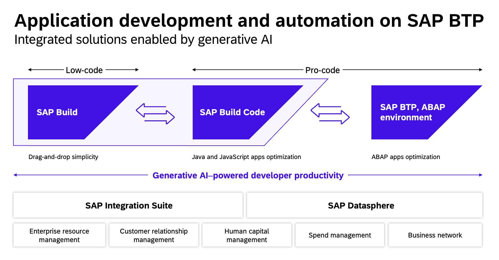
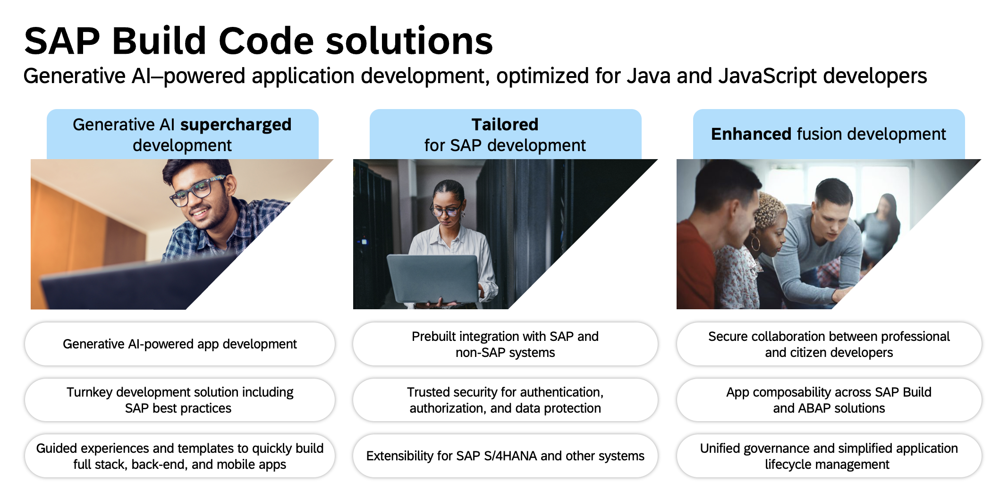

# Bringing UI to the Next Level: Develop SAPUI5 with SAP Build Code

## SAP Build Code
Last year, SAP launched SAP Build to empower business experts to construct applications, implement automations and compose business sites. This year, the Build family is being expanded to offer a powerful shortcut for cloud application development with the introduction of **SAP Build Code**.

**SAP Build Code** unifies essential application development tools such as SAP Business Application Studio, SAP Cloud Application Programming Model (CAP), SAPUI5, SAP Mobile Services, and SAP Document Management Services. It is powered by the generative AI copilot, Joule, and enables interoperability with ABAP Cloud. Additionally, it facilitates seamless collaboration with SAP Build's low-code solutions and provides robust governance and lifecycle management features.

This hands-on exercise will assist you in learning how to **build SAPUI5 applications using SAP Build Code**.

## Description

Learn how to develop an SAPUI5 freestyle application using SAP Build Code, TypeScript, and the latest tools and best practices from SAP. In general, when using SAPUI5, you can decide whether you would like to implement applications using TypeScript or JavaScript. This tutorial, however, is exclusively using TypeScript. Don't be afraid, the difference is very small and not hard to understand.

## Exercises

Completing the following exercises will guide you through developing web applications using the SAPUI5 framework and TypeScript.

[Exercise 0 - Getting Started](exercises/ex0/) 
[Exercise 1 - Project Setup Using Business Application Studio](exercises/ex1/) (*[browse sources](https://github.com/SAP-samples/teched2023-AD265/tree/code/exercises/ex1)*) 
[Exercise 2 - Add First Content](exercises/ex2/) (*[browse sources](https://github.com/SAP-samples/teched2023-AD265/tree/code/exercises/ex2)*) 
[Exercise 3 - Show Sensor Content](exercises/ex3/) (*[browse sources](https://github.com/SAP-samples/teched2023-AD265/tree/code/exercises/ex3)*) 
[Exercise 4 - Introduce Localization](exercises/ex4/) (*[browse sources](https://github.com/SAP-samples/teched2023-AD265/tree/code/exercises/ex4)*) 
[Exercise 5 - Improve Visualization](exercises/ex5/) (*[browse sources](https://github.com/SAP-samples/teched2023-AD265/tree/code/exercises/ex5)*) 
[Exercise 6 - Filtering With the IconTabBar](exercises/ex6/) (*[browse sources](https://github.com/SAP-samples/teched2023-AD265/tree/code/exercises/ex6)*) 
[Exercise 7 - Fragment Containing a Dialog](exercises/ex7/) (*[browse sources](https://github.com/SAP-samples/teched2023-AD265/tree/code/exercises/ex7)*) 
[Exercise 8 - Second View with Navigation](exercises/ex8/) (*[browse sources](https://github.com/SAP-samples/teched2023-AD265/tree/code/exercises/ex8)*) 
[Exercise 9 - Card with Sensor Details](exercises/ex9/) (*[browse sources](https://github.com/SAP-samples/teched2023-AD265/tree/code/exercises/ex9)*) 
[Exercise 10  - Deployment to SAP BTP - Cloud Foundry runtime](exercises/ex10/)

Start with exercise 0 [here](exercises/ex0/).

## Contributing
Please read [CONTRIBUTING.md](./CONTRIBUTING.md) to understand the contribution guidelines.

## Code of Conduct
Please read the [SAP Open Source Code of Conduct](https://github.com/SAP-samples/.github/blob/main/CODE_OF_CONDUCT.md).

## How to obtain support
Support for the content in this repository is available during the actual time of the online session on November 2nd for which this content has been designed. Otherwise, you may ask for support via the [Issues](../../issues) tab.

## Stay in touch
Stay in touch with the community by choosing your favourite channel.

**UI5**:
* Landing page: [OpenUI5 Website](https://openui5.org/)
* Podcasts series: [UI5 Newscast](https://podcast.opensap.info/ui5-newscast/)
* Blog posts: [UI5ers Buzz](https://blogs.sap.com/tag/ui5ers-buzz/)
* X / Twitter: [@openui5](https://twitter.com/openui5)
* Slack: [Get Access to OpenUI5 Slack Workspace](https://ui5-slack-invite.cfapps.eu10.hana.ondemand.com/)

**SAP Open Source**:
* Landing page: [Run better together with open source](https://developers.sap.com/open-source.html)
* Podcasts series: *[The Open Source Way](https://podcast.opensap.info/open-source-way/2020/10/28/corona-warn-app-behind-the-scenes/)*
* Blog posts: [open source on SAP Community](https://blogs.sap.com/tags/b2aac474-1581-4b1b-8932-de5f60b52558/)
* X / Twitter: [@sapopensource](https://twitter.com/sapopensource)

## Further tutorials and lectures regarding UI5

In case you're interested in advanced topics after completing all the above exercises, here are some additional tutorials to deepen your knowledge in application development leveraging UI5:

[SAP Blog about the Flexible Programming Model](https://blogs.sap.com/2022/06/08/how-to-create-an-sap-fiori-app-using-sap-fiori-elements-sapui5-freestyle-or-a-mix-of-both-with-the-flexible-programming-model/) 
[CAP & UI5 development in an example application](https://github.com/SAP-samples/ui5-cap-event-app) 
[UI5 and TypeScript](https://github.com/SAP-samples/ui5-typescript-tutorial) 

## License
Copyright (c) 2023 SAP SE or an SAP affiliate company. All rights reserved. This project is licensed under the Apache Software License, version 2.0 except as noted otherwise in the [LICENSE](LICENSES/Apache-2.0.txt) file.
