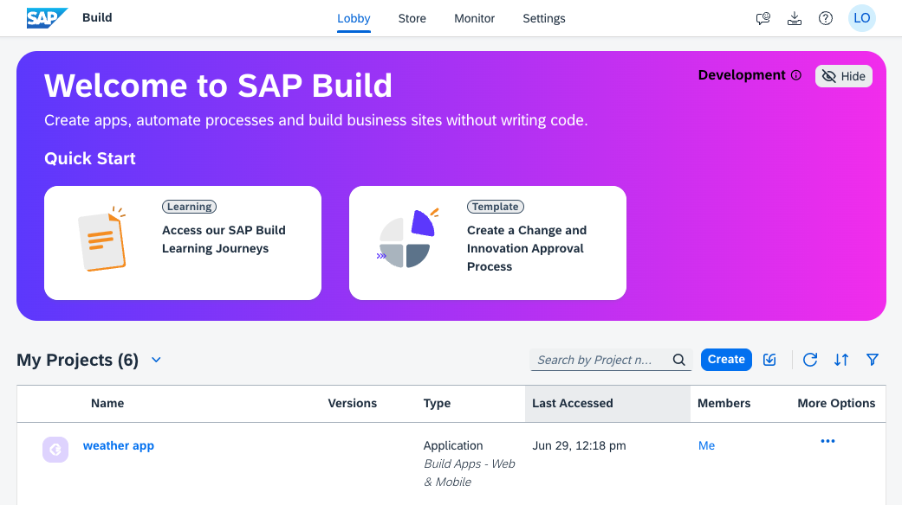
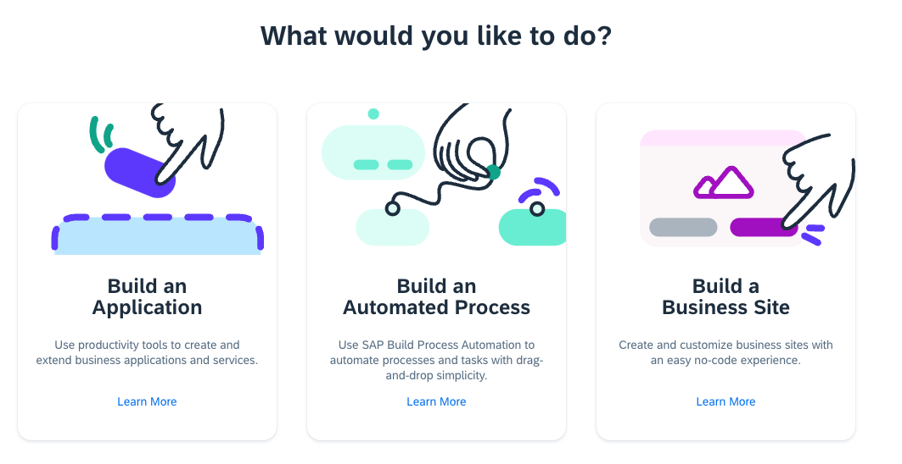
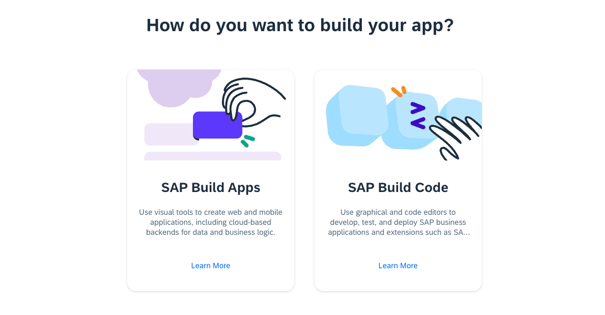
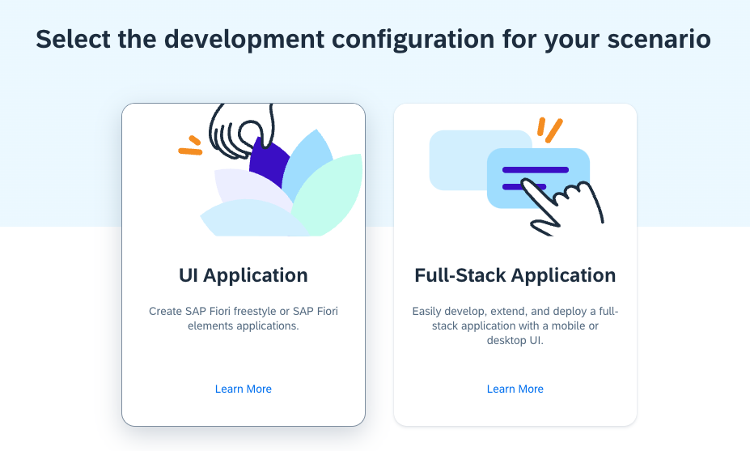
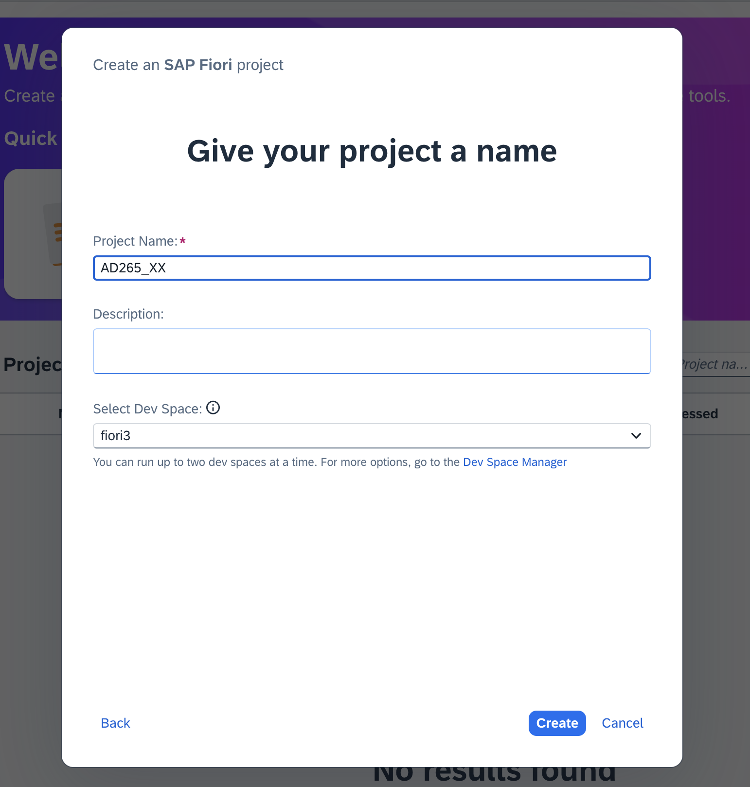
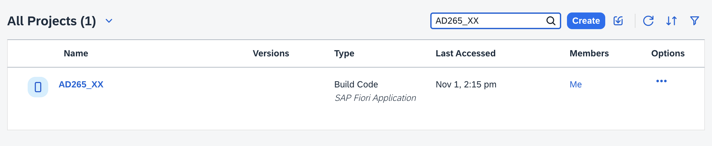
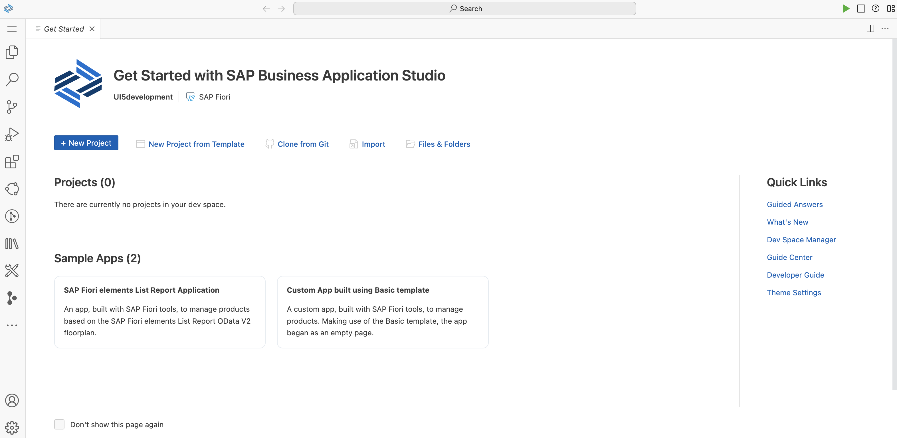

# Exercise 0 - Getting Started

In this exercise, you will be guided on how to access your SAP Business Application Studio account, set up a development space, and gain a quick introduction to its functionalities.

## Accessing the SAP Build Lobby

By the end of these steps, you will know how to navigate from the SAP Build Lobby to the SAP Business Application Studio and set it up for your development needs.

1. Open the [SAP Build Lobby](https://lcapteched.eu10.build.cloud.sap/lobby) using a web browser of your preference (Google Chrome, Microsoft Edge, Apple Safari, etc.) and log in using your credentials.

2. Click on the *Create* button above the table to start a new project.

3. It's time to *Build an Application*! Click on the corresponding tile.

4. Select the new pro-code offering *SAP Build Code*.

5. Choose *UI Application*.

6. Assign a name to your new project, for instance, *AD265_XX* , where *XX* is your user number. Leave the default dev space and click "Create".

7. Your development space is now being set up and launched. This process may take a few moments. Please wait while it is being created. You can find your new project in the table. Clicking on *AD265_XX* or the name of your project will take you to the SAP Business Application Studio

6. We recommend bookmarking this URL for easy access to the SAP Business Application Studio within your development space.

## Summary

Congratulations! You've successfully used the SAP Build Lobby to create your own project, and familiarized yourself with the basics of the platform. Keep up the momentum as you continue to [Exercise 1 - Project Setup Using SAP Business Application Studio](../ex1/README.md).
